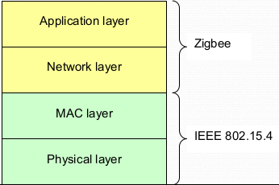
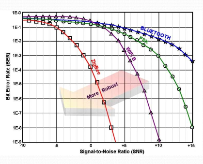

# ZigBee
ZigBee is a standard for wireless sensor networks based on the IEEE 802.15.4 physical/MAC standard.
The IEEE 802.15.4 standard specifies the physical and MAC layers for low-rate wireless personal area networks (PAN).
This standard produces and infrastructure-less wireless network for short ranged devices.
The communication over the stack in figure \ref{fig:zigbee_stack} is done using service primitives.
Each layer provides its data and management services to the upper layer and each service is specified by a set of primitives of four generic types:

- Request, it is invoked by the upper layer to request for a specific service
- Indication, it is generated by the lower layer and is directed to the upper layer to notify the occurrence of an event related to a specific service
- Response, it is invoked by the upper layer to complete a procedure previously initiated by an indication primitive
- Confirm, it is generated by the lower layer and it is directed to the upper layer to convey the results of one or more associated previous service requests

{height=20%}

## Physical layer
The physical layer can coexist with IEEE 802.11 and IEEE 802.15.1 (Bluetooth), according to the geographical location the allocated bands may vary.
As seen in figure \ref{fig:zigbee_snr} the standard offers excellent performances in low SNR environments.

The standards offers two categories of services, the data service for the transmission/reception of data through the physical medium, and different management services useful to implement policies of energy efficiency at the upper layers.

Energy detection service is used to find a free channel and for carrier sense.
The link quality indicator offers a metric for the quality of data packets that are received by a node, this service is based on ED, SNR or both.
The channel assessment service is used to detect if the channel is busy.

## MAC layer
The MAC layer offers data services, management services and security mechanisms.
The following definitions are about the main concepts of the MAC layer.

#### Reduced Function Devices
RFDs are end-devices with reduced processing, memory and communication capabilities, for instance simple sensors or small actuators.
They implement a reduced set of function of the MAC layer and are associated to an existing network and a unique FFDs on which they depend for communication.

#### Full Function Devices
FFDs implement the full MAC layer and act as the coordinator of a set of RFDs.
If they are also PAN coordinators they are responsible to set up and manage the network and the association/disassociation of the other devices.

#### Star topology
In this topology one FFD is the PAN coordinator, and the other nodes behave as RFDs.
The PAN coordinator synchronizes all the communications in the network.
Different stars have different PAN identifier and are independent.

#### Peer-to-peer topology
Each FFD communicates with any other device within its radio range.
One FFD is the PAN coordinator, the other FFD are routers.
As already stated each RFD acts as end-device and it is connected to one FFD.

### Beacon-enabled
In star topologies, or in peer-to-peer topologies organized in trees, it is possible to use a superframe structure to provide synchronization between nodes and to enable power savings of the devices.
Using a superframe structure the time slots are equally sized.
The first time slot is used by the PAN coordinator to send a beacon frame and to begin the superframe.
The beacons are used to identify the PAN, synchronize the devices in the PAN and to communicate the structure of the superframe.
Each PAN coordinator creates its own superframe structure, the active periods of the superframe must have always the same length.
Inter-frame spacing (IFS) is used to separate different frames.

In the remaining time slots the end devices can communicate with the coordinator.
These remaining time slots are partitioned in an active period up to 16 slots and an inactive period where no communication can occur.
The time slots in the active portion are then divided into contention access period (CAP) and an optional contention free period (CFP).

#### Contention access period
The CAP period comprises up to 15 time slots.
The devices compete for channel access using a standard slotted CSMA/CA protocol.

#### Contention free period
The CFP is optional and used for low-latency applications or applications requiring specific data bandwidth.
The period in partitioned into guaranteed time slots, or GTS, each one assigned by the PAN coordinator to a specific application.
The application accesses the GTS without contention.
GTS may comprise more than one time slot.
The CFP cannot occupy all the time slots, the CAP period is necessary for the network maintenance and operations like for instance the assignment of the GTSs.

#### End-device to coordinator
The end device first waits for the network beacon to synchronize with
the superframe.
If it owns a GTS it uses it without contention, otherwise it transmits the data frame to the coordinator using the slotted CSMA-CA protocol in one of the frames in the CAP period.
The coordinator may optionally send an acknowledgement.

#### Coordinator to end-device
The coordinator stores the message and signals that the message is pending in the beacon.
The end-device usually sleeps most of the time and it occasionally listens to the beacon to check for pending messages.
When it notices that a message is pending, it requests the message to the coordinator during the CAP, this is immediately acknowledged by the coordinator.
The coordinator sends the pending message in a successive slot of the CAP.
The device must send an acknowledgment frame in a successive time slot.
The coordinator removes the pending message from its list.

#### Peer-to-peer
Peer-to-peer communication is not possible for two end-devices since they cannot communicate directly.
So it is only possible between the coordinator and a router, or between two routers.
The sender must first synchronize with the destination beacon and act as an end device.
The measures to be taken in order to synchronize coordinators are beyond the scope of the IEEE 802.15.4 standard.

### Non beacon-enabled
The PAN coordinator may avoid the use of the superframe structure, in this scenario the PAN is called non beacon-enabled and the communication is based on unslotted CSMA/CA protocol.
The coordinators are always on and ready to receiver data from the end-devices.

#### End-device to coordinator
The end device simply transmits its data frame to the coordinator using
unslotted CSMA-CA.
The coordinator must be always active.
The coordinator acknowledges the successful reception of the data by transmitting an optional acknowledgment frame. 

#### Coordinator to end-device
The coordinator stores the message and waits for the device to request for the
data.
A device can inquiry the coordinator for pending messages by transmitting a Data request (using unslotted CSMA/CA).
The coordinator send an ACK for the request.
The coordinator transmits the pending message(s) to the devices.
If no messages are pending, the coordinator transmits an empty message.
The device sends an ACK and the coordinator discards the messages.

#### Peer-to-peer
Each device may communicate with every other device in its
radio range.
The devices will need to either remain always active or
synchronize with each other.
In the first case the device can directly transmit the data
In the latter case the devices synchronization is beyond the scope of the IEEE 802.15.4 standard, since it is left to the upper layers.
