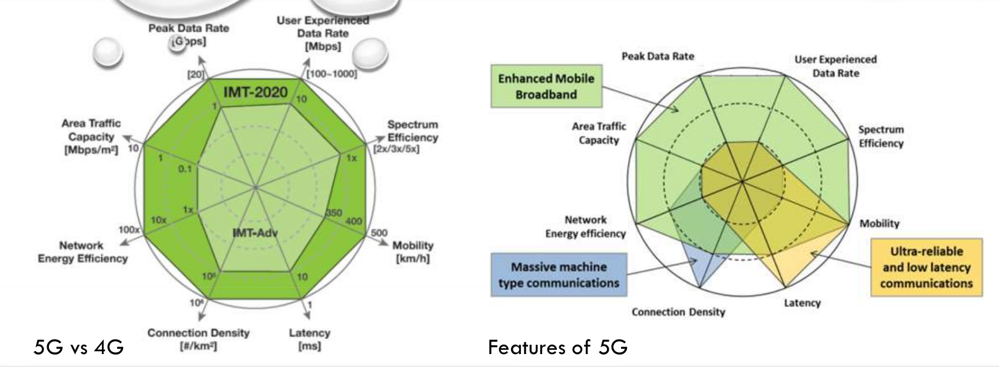

# Introduction
Network mobility history starts in the 80s, in the first generation technology a voice signal could be delivered using a circuit switched analog system.
In circuit switching to enable two nodes to communicate with each other a dedicated physical link is reserved in the network.

Since 2.5G the circuit switched communication is complemented by a packet switched one for data transmission while, at least in the older generations, the voice signal is still transmitted via circuit switching.

As seen in figure \ref{5gfeatures} the 5G technology provides an improvement of different orders of magnitude in respect to the existing standards.
It is indeed reductive to refer to 5G as an improvement in respect to previous technologies: the softwarization of the network functions and the enlargement of the frequency bands are a radical change in communication science.

## MANETS
With the acronym MANETS, for Mobile ad-hoc networks, we refer to a decentralized type of wireless network.
In a MANET the nodes are autonomous and independent, also since their mobile and dynamic behaviour they have to be battery powered and able to communicate by exchanging packets via radio waves.

The absence of a fixed network infrastructure is dealt by the nodes via cooperation in a peer-to-peer fashion, this realizes a pure distributed system able to be reconfigured on the fly.

Originally the MANET approach was ideally thought as a replacement for the first and second generation technologies of over twenty years ago.
By now given its robustness and the rapid deploying the applications are limited to very specific use cases like emergency management, or communication in remote or hostile environments.

A fundamental concept in a MANET is the relation of neighborhood between nodes that share the same physical layer.
Given the indefiniteness of boundaries for radio waves a non trivial Media Access Control (MAC) protocol is required, this implies as a direct consequence an high bit error rate.

In IP networks the address is strictly correlated to the position of the device, even in mobile connectivity the range is given by a fixed router.
This does not hold for MANETS where frequent link failures and disconnections change arbitrarily the network topology, this implies the need for a dynamic multi-hop routing protocol where each node is a router.

Over the datalink and network layers, that are as we described different from the known IP stack, the usual transport layers protocols (TCP, UDP) are usable, providing a transparent implementation for the users.

## Wireless Sensor Networks
The sensors are devices used to monitor an environment and gather informations.
Conventionally they are thought to be simple transducers connect by a cable to a centralized control device.

Wireless sensors are instead smart and autonomous battery powered devices, that must handle the wireless communication logic.
The need for a limited but unavoidable computational power can also be used to pre-process data and build a network when the communication is not limited to the sensor-controller channel.

The distribution of the devices and their p2p behaviour resembles the ad-hoc networks, but there are some fundamental differences that justify the separation of the two concepts.
The sensors of a WSN can be in number several orders of magnitude more than the nodes in a MANET.
Also the devices are strongly constrained in power, computational capacities and memory, so they're not general purpose but instead tight integrated with their task.
